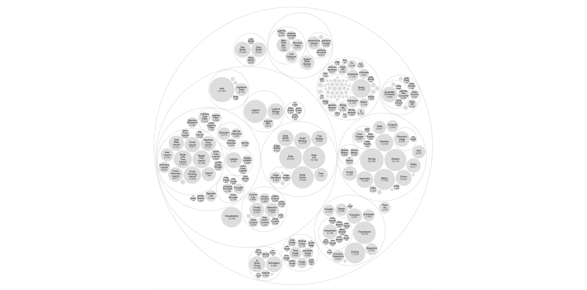
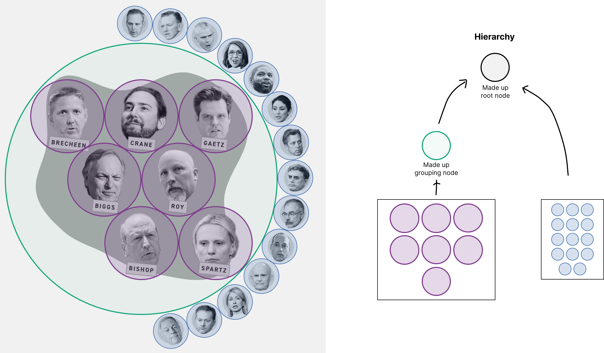

# Hacking D3 Hierarchy

Making math do your layout work for you by making up data for fun and profit.

## Separating planning from rendering

Many classic examples of using D3 [look like this][d3-line-example]:

```js
  // Set up x and y scales
  const x = d3.scaleUtc(xdomain, xrange);
  const y = d3.scaleLinear(ydomain, yrange);

  // Declare the line generator
  const line = d3.line()
      .x(d => x(d.date))
      .y(d => y(d.close));

  // Draw the line as a path in the SVG
  svg.append("path")
    .attr("fill", "none")
    .attr("stroke", "steelblue")
    .attr("d", line(data));
```

Looking closely, we can tease apart _planning_ what to draw...

```js
  // Set up x and y scales
  const x = d3.scaleUtc(xdomain, xrange);
  const y = d3.scaleLinear(ydomain, yrange);

  // Declare the line generator
  const line = d3.line()
      .x(d => x(d.date))
      .y(d => y(d.close));
```

from actually _drawing_ it.

```js
  // Draw the line as a path in the SVG
  svg.append("path")
    .attr("fill", "none")
    .attr("stroke", "steelblue")
    .attr("d", line(data));
```

The planning usually involves doing some complicated math. Here, the scales let
us remap our data onto a new coordinate system, and the line generator converts
a series of data points into an SVG path string.

By separating out the _planning_ step, we can find ways to use D3's powerful
math capabilities for our own purposes.

## Enter the niche world of circle packing

D3 has sub-modules to do everything, including [circle
packing](https://en.wikipedia.org/wiki/Circle_packing) with [d3-hierarchy][].
In examples you'll generally see the typical use case look something like this:



And as the viz work that D3 is doing gets more complicated, separating out the
_planning_ from the _drawing_ can get more difficult as well.

```js
// Build a hierarchy from your data
const hierarchy = d3.hierarchy(data)
  .sum(d => d.value)
  .sort((a, b) => b.value - a.value);

// Set up a packing function to compute the circles
const pack = (data) => d3.pack()
  .size([width, height])
  .padding(3);

// Pack your hierarchy and convert it into a node tree to draw
const root = pack(hierarchy)(data);
```

But it's also where we can unlock some real power!

## Making up data to trick D3 into helping us

I've never had a real use case for a proper circle-packing viz. But I _have_
had to render groups of head cutouts in multiple projects.


Easy enough to lay that out by hand, but if you have a lot of groups and
reporters are adding and removing people up until the last minute, that quickly
becomes a pain.

Circle packing to the rescue!



[d3-hierarchy]: https://d3js.org/d3-hierarchy
[d3-pack-example]: https://observablehq.com/@d3/pack-component
[d3-line-example]: https://observablehq.com/@d3/line-chart/2
