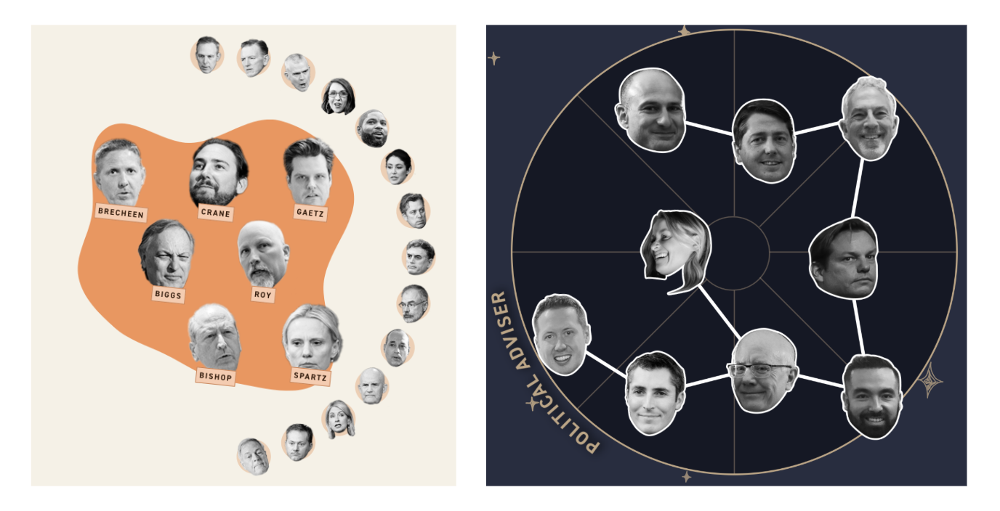

# Off-label uses of D3

Making math do your layout work for you by making up data for fun and profit.

## Separating planning from rendering

Many classic examples of using D3 [look like this][d3-line-example]:

```js
  // Set up x and y scales
  const x = d3.scaleUtc(xdomain, xrange);
  const y = d3.scaleLinear(ydomain, yrange);

  // Declare the line generator
  const line = d3.line()
    .x(d => x(d.date))
    .y(d => y(d.close));

  // Draw the line as a path in the SVG
  svg.append("path")
    .attr("fill", "none")
    .attr("stroke", "steelblue")
    .attr("d", line(data));
```

Looking closely, we can tease apart _planning_ what to draw...

```js
  // Set up x and y scales
  const x = d3.scaleUtc(xdomain, xrange);
  const y = d3.scaleLinear(ydomain, yrange);

  // Declare the line generator
  const line = d3.line()
    .x(d => x(d.date))
    .y(d => y(d.close));
```

from actually _drawing_ it.

```js
  // Draw the line as a path in the SVG
  svg.append("path")
    .attr("fill", "none")
    .attr("stroke", "steelblue")
    .attr("d", line(data));
```

The planning usually involves doing some complicated math. Here, the scales let
us remap our data onto a new coordinate system, and the line generator converts
a series of data points into an SVG path string.

By separating out the _planning_ step, we can find ways to use D3's powerful
math capabilities for our own purposes.

## Enter the niche world of circle packing

D3 has sub-modules to do everything, including [circle
packing](https://en.wikipedia.org/wiki/Circle_packing) with [d3-hierarchy][].
In examples you'll generally see the typical use case look something like this:


And as the viz work that D3 is doing gets more complicated, separating out the
_planning_ from the _drawing_ can get more difficult as well.

```js
// Stratify the data into a tree form
const stratify = d3.stratify()
  .id((d) => d.name)
  .parentId((d) => d.group);
const stratifiedData = stratify(dataToStratify);

// Build a hierarchy from your data
const hierarchyData = d3.hierarchy(stratifiedData)
  .sum(d => d.value)
  .sort((a, b) => b.value - a.value);

// Set up a packing function to compute the circles
const pack = d3.pack()
  .size([width, height])
  .padding(3);

// Pack your hierarchy and convert it into a node tree to draw
const root = pack(hierarchyData);
```

But it's also where we can unlock some real power!

## Making up data to trick D3 into helping us

I've never had a real use case for a proper circle-packing viz. But I _have_
had to render groups of head cutouts in multiple projects.



Easy enough to lay that out by hand, but if you have a lot of groups and
reporters are adding and removing people up until the last minute, that quickly
becomes a pain.

Circle packing to the rescue!


## Fudging the numbers

Let's look at an example to see what this looks like in practice.


We start out with some data representing the "people" that we want to lay out
in clusters. Each person has a `name` that identifies them and a `group` that
specifies which group they're going to be in. Here, people are either in the
"focused" group, meaning they should end up in the big group, or they're in the
"root" group, meaning they should be shirked off to the periphery.

```js
const data = [
  {
    name: "Alice",
    group: "focused",
  },
  {
    name: "Bob",
    group: "focused",
  },
  // ...
  {
    name: "Frank",
    group: "root",
  },
  {
    name: "Gabrielle",
    group: "root",
  },
  // ...
];
```

Next, we have to add in a couple of "made up" nodes to represent the groups
themselves.

```js
const dataToStratify = [
  { name: "root", group: "" }, // the parent of everything
  { name: "focused", group: "root" }, // the parent of our "focused" group
  ...dataWithGroups, // all our actual data points
];
```

Now we can use the `stratify` function from [d3-hierarchy][] to reorganize the
data into a nested tree of objects.

```js
const strat = stratify()
  .id((d) => d.name)
  .parentId((d) => d.group);
const stratifiedData = strat(dataToStratify);
```

With our data in tree form, we can compute some information about its
hierarchy, summing up individual values from each node to compute the total
value contained by parent nodes.

```js
const dataHierarchy = hierarchy(stratifiedData)
  .sum((d) => d.data.group === "focused" ? 10 : 2);
```

Finally, we can use that hierarchy information to compute the circle pack
layout for our dataset.

```js
const makePack = pack()
  .size([width, height])
  .padding(padding);
const root = makePack(dataHierarchy);
```

At the end of the day, the `root` object will look something like this:

```js
{
  r: 250,
  x: 250,
  y: 250,
  // ... other metadata
  children: [
    {
      r: 210,
      x: 213,
      y: 254,
      // ... other metadata
    },
    // ... more nodes
  ],
}
```

So now we have a data-driven representation of how our people should be laid
out on the page, and we can use that to render our visual! If the groups change
or we add or subtract a person, the whole layout will update automatically.
Yay!

[d3-hierarchy]: https://d3js.org/d3-hierarchy
[d3-pack-example]: https://observablehq.com/@d3/pack-component
[d3-line-example]: https://observablehq.com/@d3/line-chart/2
